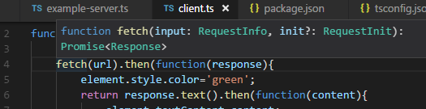

# cosas que hay que averiguar de Typescript o Visual Studio Code

## Visual Studio Code

### ¿Cómo se usa el `npm`?
¿Cómo se pone por ejemplo `npm install` desde el visual studio?

### ¿Cómo se indica que alguos .ts son es5 y otros es2015?
Los .js que están destinados a ir a cualquier navegador vamos a generarlos con ES5 y algún conjunto conocido de polyfills (como require-bro o lo que sea).

Los .js que están destinados a ir solo al Chrome (porque son de aplicaciones internas que no van a dispositivo móvil) y los .js que van al servidor los vamos a generar en es2015 o en algo mejor si el Chrome y el node.js ya lo entienden.

Dentro de un proyecto (por ejemplo `backend-plus` hay .js destinados solo al servidor y otros a ambos)

### ¿Cómo se navega dentro de las definiciones?

Por ejemplo si se menciona `fetch` acercando el mouse se ve la definición de `fetch` 
pero esta definición depende de `RequestInfo`. 

**¿Cómo se navega para ver la definición de `RequestInfo`?**

