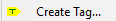

## Ejemplo

Como ejemplo usé el paquete server4test que había estado adaptando a TypeScript.

Supuse el siguiente escenario. Teníamos una version (0.1.0) que era la última que andaba en .js, 
luego para pasarla a TypeScript (y hacerlo prolijo) tuve que cambiar algo sustancial, 
en la versión 0.1.0 se exportaba la clase como único objeto `export=Server`, 
en la versión 0.2.0 se exporta la clase como un objeto más `export.Server=Server`. 

En ese escenario queremos una nueva versión (compatible con 0.1.0) que haga logs, 
los mismos logs que ya programé mientras hacía la versión para typescript. 
Entonces busqué los commits donde está ese cambio (el agregado de los console.log),
luego de encontarlos genero el patch con este comando:

```sh
git diff -p c795a21712682163fc8dc78ef65f63aeb78eb9de..6b957d9282d06c84789fba23a0a99f4dc5df5f1f -- server4test.js >c:\temp\diffs\server4test-test2.patch
```

Si miro cómo queda el diff queda así:
```diff
diff --git a/server4test.js b/server4test.js
index 05cc664..f29f71e 100644
--- a/server4test.js
+++ b/server4test.js
@@ -27,6 +27,9 @@ class Server{
                 if(err){
                     reject(err);
                 }else{
+                    if(server.opts.verbose){
+                        console.log("Listening at",server.port);
+                    }
                     resolve();
                 }
             });
@@ -40,6 +43,9 @@ class Server{
         return new Promise(function(resolve,reject){
             try{
                 server.listener.close(function(err){
+                    if(server.opts.verbose){
+                        console.log("server closed")
+                    }
                     if(err){
                         reject(err);
                     }else{
```

Después hice Shift/Checkout 
para posicionarme en el checkout correspondiente a la versión 0.1.0. 
Le apliqué un TAG  y agregué la diferencia a la posición actual:

```sh
git apply --whitespace=warn c:\temp\diffs\server4test-test2.patch
```

(Claro que estoy aplicando un parche al mismo archivo del que lo saqué, 
podría haber exportado directamente el archivo cambiado, pero no servía como experimento). 

Luego cambié el `package.json` para subirle la versión a 0.1.1, le puse un tag 
y lo publiqué con `npm publish` (que me lo permitió aún habiendo publicado antes la 0.2.0). 

Esto es útil para cuando tengamos que hacer **hot fixes**

