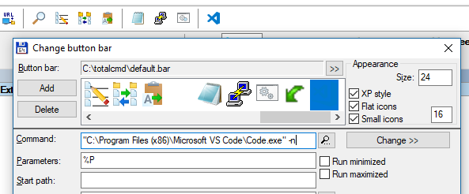

# ¿Por qué vamos empezar a usar TypeScript?

   * Porque es tipado (y eso detecta errores de tipos antes de probar el programa)
   * Porque está basado en Javascript (entonces la curva de aprendizaje no debería ser muy grande)
   * Porque si lo necesitamos genera código Javascript compatible con navegadores más viejos

## Ver

   * [Writing Modern JavaScript with TypeScript](http://www.instrument.com/articles/writing-modern-javascript-with-typescript), breve introducción a lo escencial de Typescript 

   * [Understanding ES5, ES2015 and TypeScript](https://johnpapa.net/es5-es2015-typescript/), por qué usar TypeScript
   
   * Playground de Typescript https://www.typescriptlang.org/play/
   
   * Chat activo https://gitter.im/Microsoft/TypeScript
   
## Qué instalar y configurar

### Typescript
```sh
npm install -g typescript
```
### Visual Studio Code
Tips:
  * Paleta de comandos: ctrl + shift + p ahí se puede buscar como hacer cualquier cosa que permite VSCode
  
Tiene las siguientes ventajas:
   * Terminal integrada.
   * Debug de código de servidor integrado.
   * Verifica los tipos mientras se programa.
   * Muestra el estado del git (qué se cambió y qué no)
   * Está basado en proyectos (o sea se abre la carpeta del proyecto, por ejemplo d:\hecho\npm\meta-enc y entiende que es un proyecto)
   * se puede hacer git commit y push desde dentro del editor
Y algunas desventajas:
   * Está basado en carpetas:
      * si se abren muchas carpetas a la vez en el mismo editor se pierde el contro de git y de los proyectos
      * se pueden abrir varias instancias (como se explica más abajo con el totat commander), pero eso hace que uno pueda terminar teniendo abiertos muchos editores incluso algunos repetidos en la misma carpeta
   * no queda claro cuál es el mecanismo de actualización y de detección de cambios en los archivos, cuando un archivo no está grabado no sabemos bien qué pasa. Tenemos que investigar esto. 


### En el Total commander
Se puede poner un ícono para que abra la carpeta actual en una nueva instancia de Visual Studio Code


